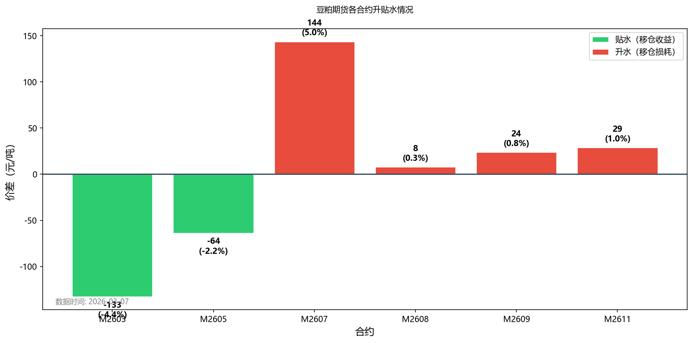
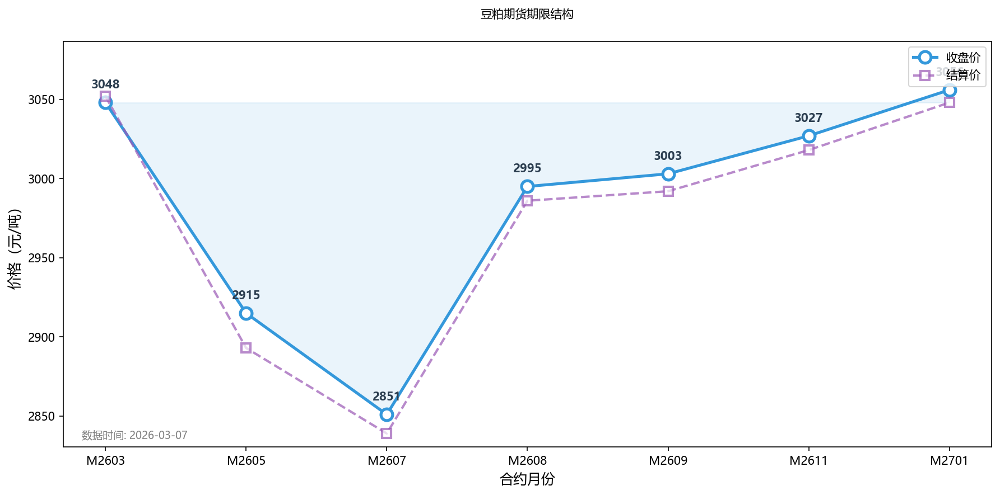

# 一文读懂豆粕ETF：从入门到看懂价格逻辑

> 这是豆粕ETF系列文章的第一篇。本文将带你了解豆粕ETF是什么，以及如何分析豆粕价格的核心逻辑。

---

## 什么是豆粕？

豆粕是**大豆压榨后的副产品**，是世界上最主要的蛋白质饲料原料。

简单来说：大豆 → 压榨 → 豆油（食用）+ 豆粕（饲料）

豆粕主要用途：
- 🐷 **生猪饲料**（占比最大）
- 🐔 **禽类饲料**
- 🐄 **牛羊等养殖饲料**

中国是全球最大的豆粕消费国，年消费量超过8000万吨，主要依赖进口大豆压榨。

---

## 什么是豆粕ETF？

**豆粕ETF** 是一种跟踪豆粕期货价格的交易所交易基金。

以最常见的 **159985（豆粕ETF）** 为例：
- 上市交易所：深交所
- 跟踪标的：大连商品交易所豆粕期货主力合约
- 交易方式：像股票一样，T+0买卖
- 管理费用：约0.5%

### 豆粕ETF vs 直接做期货

```
┌──────────┬────────────────────┬──────────────────────┐
│ 对比项   │ 豆粕ETF            │ 豆粕期货             │
├──────────┼────────────────────┼──────────────────────┤
│ 开户门槛 │ 普通股票账户即可   │ 需期货账户+资金门槛  │
│ 杠杆     │ 无杠杆（1倍）      │ 约10倍杠杆           │
│ 交易时间 │ 9:30-15:00         │ 夜盘到23:00          │
│ 持仓成本 │ 管理费+展期损耗/收益│ 保证金利息           │
│ 适合人群 │ 普通投资者         │ 专业投资者           │
└──────────┴────────────────────┴──────────────────────┘
```

**总结**：豆粕ETF是普通投资者参与大宗商品市场最便捷的途径，无需开期货账户，风险相对可控。

---

## 豆粕期货合约展期：升贴水是什么？

投资豆粕ETF有一个**容易被忽略的成本或收益**——合约展期（换月）。

### 展期的基本概念

豆粕期货有不同月份的合约（如M2603、M2605等），ETF会在临近交割时从近月合约换到远月合约，这个过程叫"展期"或"移仓"。

- **升水（Contango）**：远月价格 > 近月价格  
  👉 展期时，卖低（近月）买高（远月），**ETF净值会下跌**

- **贴水（Backwardation）**：远月价格 < 近月价格  
  👉 展期时，卖高（近月）买低（远月），**ETF净值会上涨**

### 重要说明：收益如何体现？

> ⚠️ **关键理解**  
> 
> 很多人误以为展期会改变持有的ETF份额，实际上：
> - ✅ **您的ETF份额数量不会变化**  
> - ✅ **收益/损耗体现在ETF净值的变化上**
> 
> **举例**：  
> 假设您持有10000份豆粕ETF，净值2.00元/份，总市值20000元。
> 
> **贴水展期时**（近月3000元，远月2800元）：
> - ETF管理人卖出近月（高价3000），买入远月（低价2800）
> - 同样资金可买入更多期货合约，**净值上涨**
> - 您的份额：仍然10000份
> - 净值：涨到2.01元/份
> - 总市值：20100元 ✅ **赚了100元**
> 
> **升水展期时**（近月3000元，远月3200元）：
> - ETF管理人卖出近月（低价3000），买入远月（高价3200）
> - 同样资金只能买入更少期货合约，**净值下跌**
> - 您的份额：仍然10000份
> - 净值：跌到1.99元/份
> - 总市值：19900元 ❌ **亏了100元**

### 当前升贴水情况（2026年1月28日）

```
┌───────┬────────┬──────────┬────────────────┬──────────┬──────────────┐
│ 合约  │ 收盘价 │ 持仓量   │ 与下一合约价差 │ 价差比例 │ 移仓影响     │
├───────┼────────┼──────────┼────────────────┼──────────┼──────────────┤
│M2601  │ 3133   │ -        │ -53            │ -1.7%    │ 贴水（赚）   │
│M2603  │ 3080   │ 44.6万手 │ -298           │ -9.7%    │【贴水（赚）】│
│M2605  │ 2782   │【218万手】│ -56           │ -2.0%    │ 贴水（赚）   │
│M2607  │ 2726   │ 45.1万手 │ +148           │ +5.4%    │ 升水（亏）   │
│M2608  │ 2874   │ 12.4万手 │ +7             │ +0.2%    │ 升水（亏）   │
│M2609  │ 2881   │ 50.9万手 │ +20            │ +0.7%    │ 升水（亏）   │
│M2611  │ 2901   │ 10.5万手 │ -              │ -        │ -            │
└───────┴────────┴──────────┴────────────────┴──────────┴──────────────┘
```

**图表展示：**





**当前分析**：
- **主力合约**：M2605（持仓量最大，超218万手）
- **期限结构**：近月（M2601-M2605）呈现明显**贴水结构**，远月（M2607-M2611）略有升水
- **整体判断**：贴水约**232元/吨**，对长期持有ETF者有利

> 💡 **投资者如何理解？**  
> 当前如果你持有豆粕ETF，在换月时不仅不会亏损，反而可能获得展期收益。这是投资豆粕ETF相对有利的时机。

> ⚠️ **注意**：升贴水结构会随市场变化，需要持续跟踪。

---

## 豆粕价格的核心逻辑

理解豆粕价格，要从**供给**和**需求**两端入手。

### 供给端

1. **大豆进口**  
   中国90%以上的大豆依赖进口，主要来自：
   - 🇧🇷 **巴西**（最大来源）
   - 🇺🇸 **美国**
   - 🇦🇷 **阿根廷**
   
   **2025年进口数据**：
   - **中国进口总量**：1.12亿吨（创历史新高，同比增长6.5%）
   - **巴西供应**：约8500万吨（占比约76%）
   - **美国供应**：约1200万吨（受贸易协议约束）
   - **阿根廷供应**：占比相对较小
   
   **各国产量情况**（2025/26年度USDA数据）：
   - 🇧🇷 **巴西**：1.78亿吨（创纪录高位，全球第一）
   - 🇺🇸 **美国**：42.6亿蒲式耳（约1.16亿吨）
   - 🇦🇷 **阿根廷**：4750万吨（较上年下降）
   
   **关注点**：
   - 进口成本 = 国际豆价 + 海运费 + 汇率
   - 巴西大豆关税3%，美国大豆关税13%（价格竞争力差异）
   - 巴西产量创纪录是2025年进口增长的主要动力

2. **压榨利润**  
   油厂开工率取决于压榨利润：
   - 利润好 → 多开工 → 豆粕供应增加 → 价格承压
   - 利润差 → 减开工 → 豆粕供应减少 → 价格支撑
   
   **2025年压榨情况**：
   - 中国豆粕年产量超过7000万吨（全球第一）
   - 压榨消费占大豆总消费量的80%以上

### 需求端

**2025年中国大豆消费需求**：1.14亿吨（与上年基本持平）

1. **生猪养殖（最核心）**  
   猪饲料消耗占豆粕需求的50%以上。
   - 能繁母猪存栏量 ↑ → 豆粕需求 ↑
   - 生猪存栏量 ↑ → 豆粕需求 ↑
   
   > 💡 **趋势**：随着饲用豆粕减量替代技术推广，豆粕消费占比在逐步下降

2. **禽类养殖**  
   鸡鸭等禽类饲料也是重要需求来源。

3. **季节性规律**  
   - 春节前后：养殖消费旺季，需求较强
   - 夏季：高温影响养殖，需求相对平淡

### 价格分析框架

```
豆粕价格 = f(供给, 需求, 宏观, 情绪)

供给因素：
├── 大豆进口量和成本
├── 压榨利润和开工率
└── 豆粕库存水平

需求因素：
├── 生猪存栏和能繁母猪存栏
├── 禽类存栏
└── 饲料企业采购节奏

宏观因素：
├── 汇率（美元/人民币）
├── 国际大豆价格（CBOT）
└── 贸易政策（关税、进口配额）

情绪因素：
├── 市场投机
└── 突发事件（天气、疫情、贸易战）
```

---

## 小结

1. **豆粕ETF**是普通投资者参与商品市场的便捷工具
2. **升贴水**结构影响长期持有收益，当前为贴水（约232元/吨）、对持有者有利
3. 分析豆粕价格要关注**供给**（进口、压榨）和**需求**（养殖业）
4. **猪周期**是影响豆粕需求的最核心变量

---

**下一篇预告**：《猪周期与豆粕投资：如何把握节奏？》

我们将深入探讨猪周期与豆粕价格的联动关系，以及如何利用周期规律进行择时。

---

> 💡 **本文数据来源**：大连商品交易所、新浪财经，数据截至2026年1月28日。
> 
> ⚠️ **免责声明**：本文仅供学习交流，不构成投资建议。投资有风险，入市需谨慎。

---

**#豆粕ETF #商品投资 #资产配置 #猪周期**
