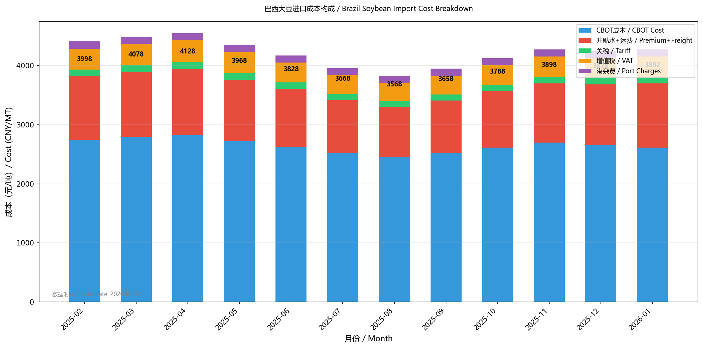
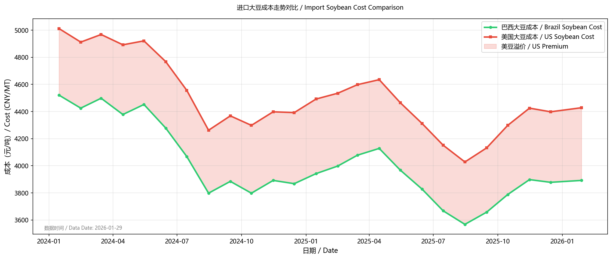
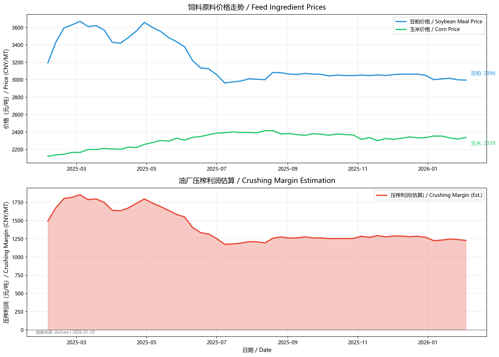
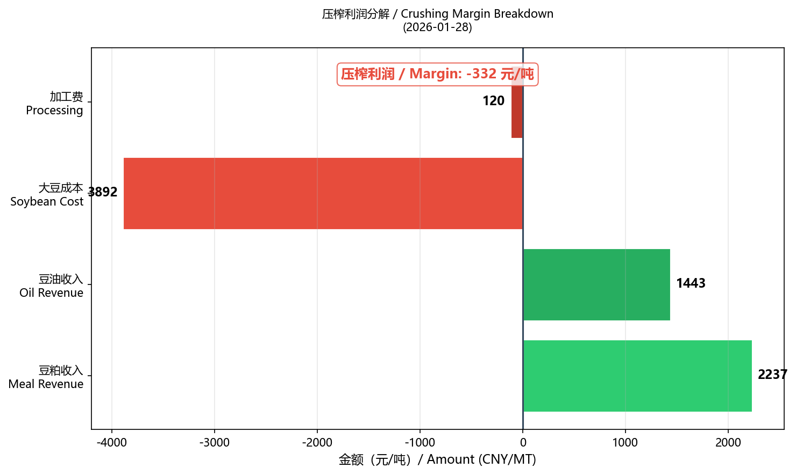
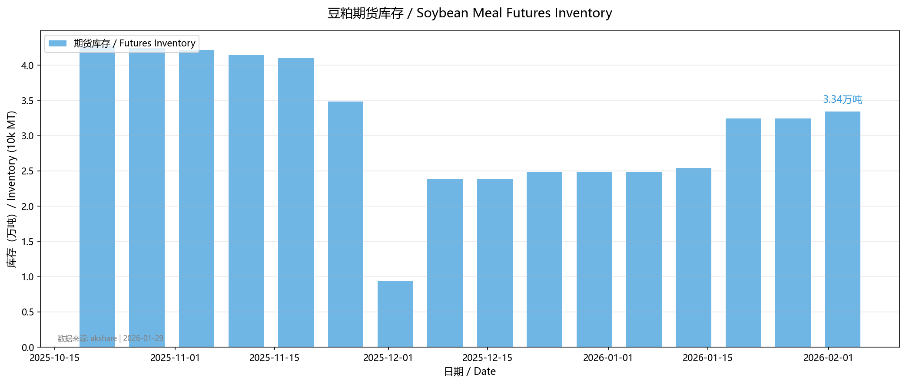
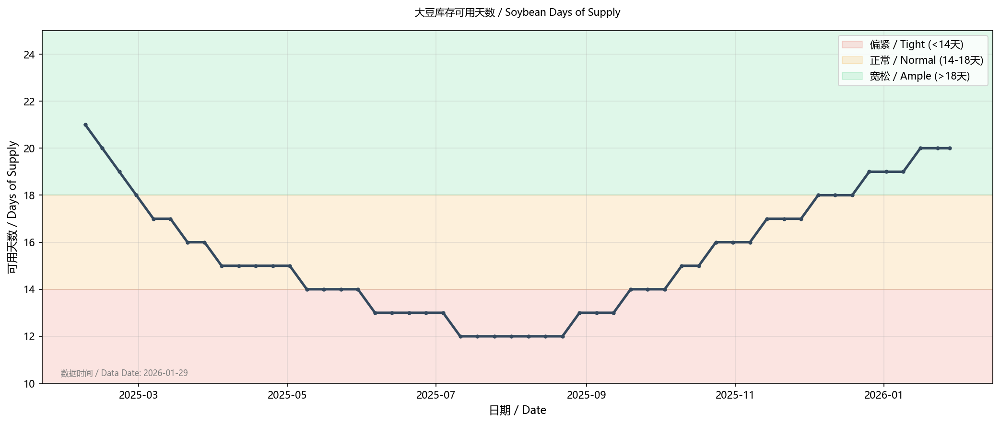
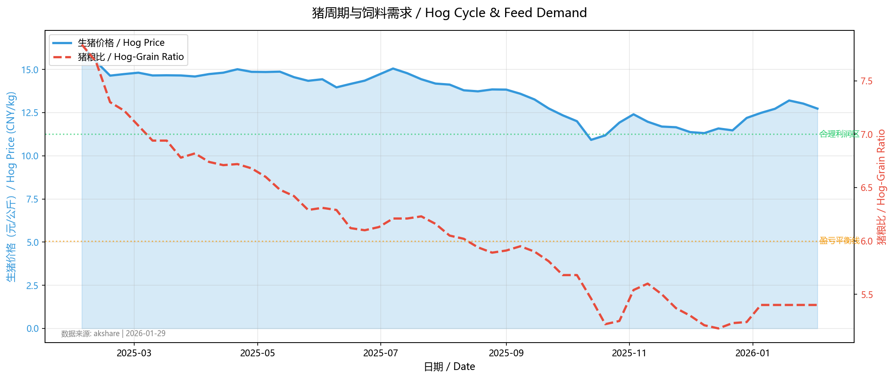
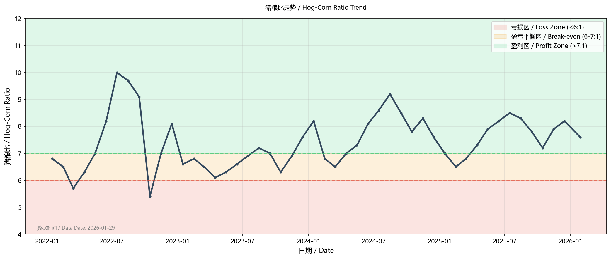
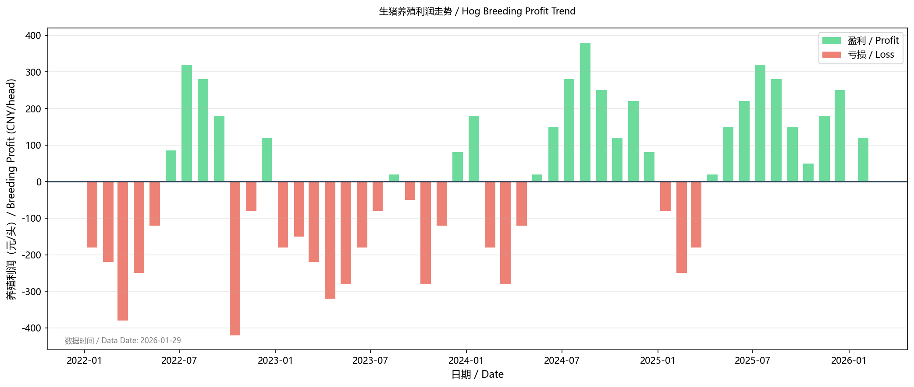

# 豆粕供需分析：从数据到投资决策

> 这是豆粕ETF系列文章的第二篇。本文将深入分析豆粕的供需两端，建立完整的分析框架，帮助你理解豆粕价格的驱动因素。

---

## 前言：为什么要做供需分析？

在上一篇文章中，我们了解了豆粕ETF的基本概念和升贴水逻辑。但要真正把握投资机会，还需要理解：

- **豆粕的供给从哪里来？** —— 进口成本是价格的"锚"
- **豆粕的需求由什么决定？** —— 养殖周期是需求的"钟摆"
- **供需如何影响价格？** —— 建立自己的分析框架

```
豆粕价格 = f(供给成本, 需求强度, 库存水平, 市场情绪)
```

---

## 第一部分：供给端分析

### 1.1 进口大豆：供给的源头

中国90%以上的大豆依赖进口，根据USDA WASDE-667报告，2025/26年度中国大豆进口预测为**1.12亿吨**。

**主要进口来源**（估算比例，实际请查询海关数据）：

| 国家 | 2025年供应量 | 占比 | 关税 | 英文名 |
|------|-------------|------|------|--------|
| 🇧🇷 巴西 | ~8500万吨 | 76% | 3% | Brazil |
| 🇺🇸 美国 | ~1200万吨 | 11% | 28%* | United States |
| 🇦🇷 阿根廷 | ~800万吨 | 7% | 3% | Argentina |
| 其他 | ~700万吨 | 6% | - | Others |

> *注：美国大豆关税 = 3%(MFN) + 25%(加征关税)，2018年7月起实施

### 1.2 全球大豆种植与收获季节

理解大豆的**种植-收获-出口-到港**时间线，是把握供给节奏的关键。

#### 🇧🇷 巴西 (Brazil) —— 全球第一大产区

| 阶段 | 时间 | 说明 |
|------|------|------|
| 种植期 (Planting) | 9月-12月 | 主产区马托格罗索州(Mato Grosso)最早 |
| 生长期 (Growing) | 12月-2月 | 关键期，关注降雨量 |
| 收获期 (Harvest) | 1月-5月 | **1-2月开始收获，3-4月高峰** |
| 出口高峰 (Export Peak) | 3月-7月 | 桑托斯港(Santos)、帕拉纳瓜港(Paranagua) |
| **到达中国** | 4月-8月 | **航程约35-45天** |

**巴西大豆特点**：
- 产量：2025/26年度USDA预测**1.78亿吨**（创历史新高！）
- 占中国进口的**76%**，是最主要来源
- 收获期与美国错开，形成互补
- **3-4月**是巴西大豆集中到港期，往往对国内豆粕价格形成压力

#### 🇺🇸 美国 (United States) —— 全球定价中心

| 阶段 | 时间 | 说明 |
|------|------|------|
| 种植期 (Planting) | 4月下旬-6月 | 主产区集中在中西部"玉米带" |
| 生长期 (Growing) | 6月-8月 | **关键期**，关注干旱/洪涝 |
| 收获期 (Harvest) | 9月-11月 | **10月高峰** |
| 出口高峰 (Export Peak) | 10月-次年2月 | 密西西比河→墨西哥湾出口 |
| **到达中国** | 11月-次年3月 | **航程约30-35天** |

**美豆特点**：
- 产量：2025/26年度预估**1.16亿吨**（USDA WASDE-667预测）
- 受**中美贸易关系**影响，对华出口大幅下降
- 加征25%关税后，成本比巴西高约**500元/吨**
- 但**CBOT价格**仍是全球定价基准

#### 🇦🇷 阿根廷 (Argentina) —— 第三大产区

| 阶段 | 时间 | 说明 |
|------|------|------|
| 种植期 (Planting) | 10月-12月 | 比巴西略晚 |
| 生长期 (Growing) | 1月-3月 | 关注拉尼娜干旱风险 |
| 收获期 (Harvest) | 3月-6月 | **4-5月高峰** |
| 出口高峰 (Export Peak) | 4月-8月 | 罗萨里奥港(Rosario) |
| **到达中国** | 5月-9月 | **航程约40-50天** |

**阿根廷特点**：
- 产量：2025/26年度USDA预测**4850万吨**
- 以**豆粕和豆油出口为主**（国内压榨后出口）
- 经常受**干旱**影响，产量波动大
- 政府出口政策（出口税）影响供应节奏

#### 📅 全年供给节奏表

| 月份 | 1-2月 | 3-4月 | 5-6月 | 7-8月 | 9-10月 | 11-12月 |
|------|-------|-------|-------|-------|--------|---------|
| **巴西** | 收获开始 | **收获高峰** | 出口高峰 | 出口尾声 | - | 种植期 |
| **美国** | - | 种植准备 | 种植期 | 生长期 | **收获期** | 出口高峰 |
| **阿根廷** | 生长期 | 收获开始 | **收获高峰** | 出口高峰 | - | 种植期 |
| **到港节奏** | 美豆到港 | **巴西到港高峰** | 巴西到港 | 供给偏紧 | 青黄不接 | 美豆到港 |
| **供给压力** | 中等 | **宽松** | 宽松 | 偏紧 | **最紧** | 中等 |

**季节性规律总结**：
- **3-7月**：巴西大豆集中到港，供给宽松，价格往往承压
- **8-9月**：南美出口尾声，美豆收获前，供给相对偏紧
- **11-2月**：美豆到港+巴西新作开始收获，供给再次宽松

### 1.3 进口成本计算

**核心公式 / Core Formula**：

```
进口成本(CNY/MT) = (CBOT价格 × 0.367437 + CNF升贴水) × 汇率 × (1+关税) × (1+增值税) + 港杂费

Import Cost = (CBOT Price × 0.367437 + CNF Premium) × FX Rate × (1+Tariff) × (1+VAT) + Port Charges
```

**各组成部分**（部分数据已查询在线来源，标注日期：2026-01-29）：

| 成本项 | 当前值 | 说明 | 数据来源 |
|--------|-----------------|------|------|
| CBOT大豆 | **1075-1080美分/蒲** | Mar 2026合约(ZSH6) | CME Group官网 |
| CNF升贴水 | 需查询 | 含运费基差 | Platts/天下粮仓 |
| 汇率 | 需查询 | 美元/人民币 | 中国人民银行 |
| 关税(巴西) | 3% | 最惠国税率 | 固定 |
| 增值税 | 9% | - | 固定 |
| 港杂费 | ~120元/吨 | 港口费用 | 估算 |

> 📌 进口成本需根据上述参数实时计算，可参考天下粮仓进口成本计算器：https://www.cofeed.com/sbm/import-cost.html





### 1.3 关注CBOT大豆价格

**CBOT (Chicago Board of Trade)** 是全球大豆定价中心。

**影响CBOT价格的主要因素**：

1. **美国种植面积和单产** —— USDA报告
2. **南美产量** —— 巴西CONAB、阿根廷BCRA
3. **全球库存消费比** —— WASDE月报
4. **美元指数** —— 负相关
5. **投机资金流向** —— CFTC持仓报告

**重要报告日历**：

| 报告 | 发布机构 | 频率 | 英文全称 |
|------|----------|------|----------|
| WASDE | USDA | 每月10日左右 | World Agricultural Supply and Demand Estimates |
| 种植意向 | USDA | 3月底 | Prospective Plantings |
| 作物产量 | USDA | 每月 | Crop Production |
| 出口销售 | USDA | 每周四 | Export Sales |
| 巴西产量 | CONAB | 每月 | Companhia Nacional de Abastecimento |

### 1.4 USDA报告详解：全球大豆供需的权威预测

**USDA (United States Department of Agriculture)** 美国农业部发布的报告是全球农产品市场最权威的参考。

#### 📊 WASDE月报 —— 最重要的供需报告

**WASDE** (World Agricultural Supply and Demand Estimates) 是每月发布的全球农产品供需预测报告。

| 属性 | 说明 |
|------|------|
| 发布时间 | 每月10-12日，美东时间12:00 (北京时间次日凌晨) |
| 内容 | 全球主要农产品的产量、消费、库存、贸易预测 |
| 重要性 | ⭐⭐⭐⭐⭐ 市场高度关注，常引发剧烈波动 |

**📎 报告获取渠道**：

| 来源 | 链接 | 说明 |
|------|------|------|
| **USDA官网(英文原版)** | https://www.usda.gov/oce/commodity/wasde | 官方首发，PDF格式 |
| **USDA FAS油籽报告** | https://www.fas.usda.gov/data/oilseeds-world-markets-and-trade | 油籽专项报告 |
| **USDA PSD数据库** | https://apps.fas.usda.gov/psdonline/app/index.html | 历史数据查询 |
| **中华粮网(中文翻译)** | http://www.cngrain.com | 第一时间中文解读 |
| **天下粮仓(中文翻译)** | https://www.cofeed.com | 详细中文翻译+解读 |
| **我的农产品网** | https://www.myagric.com.cn | 中文翻译+国内影响分析 |

> 💡 **建议**：先看英文原版数据表，再参考中文解读分析。中文网站通常在报告发布后1-2小时内提供翻译。

#### 📈 2025/26年度USDA最新预测（2026年1月报告）

**全球大豆供需平衡表** (Global Soybean Supply & Demand) - 数据来源: USDA WASDE-667 (January 2026):

| 项目 | 2023/24 | 2024/25 Est. | 2025/26 Jan Proj. | 同比变化 |
|------|---------|--------------|-------------------|----------|
| **全球产量** | 3.96亿吨 | 4.27亿吨 | **4.26亿吨** | -0.3% |
| 　🇧🇷 巴西 | 1.545亿吨 | 1.715亿吨 | **1.78亿吨** | +3.8% 🔺 |
| 　🇺🇸 美国 | 1.133亿吨 | 1.191亿吨 | **1.16亿吨** | -2.6% |
| 　🇦🇷 阿根廷 | 0.482亿吨 | 0.511亿吨 | **0.485亿吨** | -5.1% |
| **全球压榨** | 3.31亿吨 | 3.59亿吨 | **3.66亿吨** | +2.0% |
| **全球消费** | 3.84亿吨 | 4.14亿吨 | **4.23亿吨** | +2.2% |
| 　🇨🇳 中国进口 | 1.12亿吨 | 1.08亿吨 | **1.12亿吨** | +3.7% |
| **期末库存** | 1.15亿吨 | 1.23亿吨 | **1.24亿吨** | +0.8% 🔺 |
| **库存消费比** | 30.0% | 29.8% | **29.4%** | -0.4pct |

> 📌 **关键解读**：2025/26年度全球大豆供需基本平衡，库存消费比29.4%，略低于上年。**巴西产量创纪录达1.78亿吨**，但美国产量和出口均下滑。美豆出口预估降至**15.75亿蒲**，为近年低位，反映贸易摩擦影响。

**美国大豆供需** (US Soybean S&D) - 数据来源: USDA WASDE-667 (January 2026):

| 项目 | 2023/24 | 2024/25 Est. | 2025/26 Jan Proj. | 单位 |
|------|---------|--------------|-------------------|------|
| 种植面积 | 83.6 | 87.3 | **81.2** | Million Acres |
| 收获面积 | 82.3 | 86.2 | **80.4** | Million Acres |
| 单产 | 50.6 | 50.7 | **53.0** | Bu/Acre |
| 产量 | 41.62亿蒲 | 43.74亿蒲 | **42.62亿蒲** | Billion Bushels |
| 期初库存 | 2.64亿蒲 | 3.42亿蒲 | **3.25亿蒲** | Billion Bushels |
| 总供给 | 44.47亿蒲 | 47.46亿蒲 | **46.07亿蒲** | Billion Bushels |
| 压榨 | 22.85亿蒲 | 24.45亿蒲 | **25.70亿蒲** | Billion Bushels |
| **出口** | 17.00亿蒲 | 18.82亿蒲 | **15.75亿蒲** | Billion Bushels |
| **期末库存** | 3.42亿蒲 | 3.25亿蒲 | **3.50亿蒲** | Billion Bushels |
| **农场价格** | $12.40/蒲 | $10.00/蒲 | **$10.20/蒲** | $/Bushel |

> 📌 **价格指引**：USDA预测2025/26年度美豆农场均价**$10.20/蒲**（较2023/24年度的$12.40下降18%），对应CBOT期货约**980-1050美分/蒲**区间。期末库存增至**3.5亿蒲**，库存水平宽松。

**中国大豆进口预测** (China Soybean Imports) - 数据来源: USDA WASDE-667:

| 年度 | 进口量 | 压榨量 | 总消费 | 期末库存 |
|------|--------|--------|--------|----------|
| 2023/24 | **1.12亿吨** | 0.99亿吨 | 1.22亿吨 | 0.43亿吨 |
| 2024/25 Est. | **1.08亿吨** | 1.04亿吨 | 1.27亿吨 | 0.44亿吨 |
| 2025/26 Proj. | **1.12亿吨** | 1.08亿吨 | 1.33亿吨 | 0.44亿吨 |

> 📌 **注意**：2024/25年度中国进口预估为**1.08亿吨**，较2023/24年度下降3.6%，主要受养殖利润下滑影响。2025/26年度预计恢复至**1.12亿吨**。

#### 📅 年度重要报告节点

| 月份 | 报告 | 重要性 | 关注点 |
|------|------|--------|--------|
| **1月** | 年度产量终值 | ⭐⭐⭐⭐⭐ | 美豆最终产量确认 |
| **2月** | 年度展望论坛 | ⭐⭐⭐⭐ | 新年度种植面积初估 |
| **3月底** | 种植意向报告 | ⭐⭐⭐⭐⭐ | **全年最重要**，新季面积预估 |
| **5月** | 首次新季预测 | ⭐⭐⭐⭐ | 新季供需首次预估 |
| **6月底** | 种植面积报告 | ⭐⭐⭐⭐⭐ | 实际种植面积确认 |
| **8月** | 首次单产预测 | ⭐⭐⭐⭐⭐ | **产量关键期**，单产初估 |
| **9-10月** | 单产调整 | ⭐⭐⭐⭐ | 收获季单产修正 |
| **11月** | 收获数据 | ⭐⭐⭐ | 产量基本确定 |

#### 🔔 如何利用USDA报告？

**报告前**：
- 关注市场预期（彭博Bloomberg、路透Reuters调查均值）
- 预期差 = 实际值 - 预期值
- 预期差越大，价格波动越剧烈

**报告解读逻辑**：

| USDA数据变化 | 市场含义 | CBOT反应 | 国内影响 |
|-------------|---------|---------|---------|
| 产量上调 / 库存上调 | 利空 (Bearish) | 下跌 | 进口成本下降 |
| 产量下调 / 库存下调 | 利多 (Bullish) | 上涨 | 进口成本上升 |

**当前市场含义（2026年1月）**：
- 巴西丰产预期强烈（1.78亿吨）→ **供给压力大**
- 全球库存消费比29.4% → **基本平衡**
- USDA价格指引$10.20/蒲 → CBOT **下方支撑较强**
- 综合判断：**供给端利空因素已较充分反映在价格中**

### 1.5 压榨利润：供给的调节阀

**压榨利润 (Crushing Margin)** 决定了油厂的开工意愿。

**公式**：
```
压榨利润 = 豆粕价格 × 78.5% + 豆油价格 × 18.5% - 大豆成本 - 加工费(120元)
```





**利润状态解读**：

| 压榨利润 | 油厂行为 | 对豆粕影响 |
|----------|----------|------------|
| > 200元/吨 | 满负荷开工 | 供应充足，价格承压 |
| 0-200元/吨 | 正常开工 | 供需平衡 |
| -200-0元/吨 | 维持开工 | 可能挺价 |
| < -200元/吨 | 降低开工 | **供应收紧，支撑价格** |

**当前状态（请查询天下粮仓获取实时数据）**：
- 压榨利润：https://www.cofeed.com/sbm/produce-profit.html
- 开工率：https://www.cofeed.com/sbm/produce-info.html
- 判断逻辑：**油厂亏损时开工率低，供应端对价格有支撑**

### 1.6 库存：供给的缓冲

**港口大豆库存** 和 **油厂豆粕库存** 是判断供给宽松程度的直接指标。





**库存水平判断**：

| 指标 | 偏紧 | 正常 | 宽松 |
|------|------|------|------|
| 港口大豆库存 | <500万吨 | 500-700万吨 | >700万吨 |
| 油厂豆粕库存 | <50万吨 | 50-80万吨 | >80万吨 |
| 可用天数 | <14天 | 14-18天 | >18天 |

**当前状态（请查询以下渠道获取实时数据）**：
- 港口大豆库存：https://www.cofeed.com/sbm/supply-demand.html
- 油厂豆粕库存：https://www.cofeed.com/sbm/supply-demand.html
- 数据解读：库存偏低则价格有支撑，库存偏高则价格承压

---

## 第二部分：需求端分析

### 2.1 猪周期：需求的核心驱动

豆粕需求的**50%以上**来自生猪养殖。理解猪周期是分析豆粕需求的关键。

**猪周期的基本逻辑**：

| 阶段 | 触发条件 | 养殖户行为 | 市场结果 |
|------|---------|-----------|---------|
| 1. 上行期 | 猪价高企 | 养殖盈利，积极补栏 | 存栏增加 |
| 2. 供应增加 | 补栏仔猪出栏 | 出栏量上升 | 猪价承压 |
| 3. 下行期 | 猪价下跌 | 养殖亏损，被迫去产能 | 存栏减少 |
| 4. 供应收缩 | 产能去化见效 | 出栏量下降 | 猪价反弹 |

> 📌 完整猪周期约3-4年，核心是"价格→利润→补栏→供应→价格"的反馈循环

**关键时滞关系**：

| 事件 | 时滞 | 传导路径 |
|------|------|---------|
| 能繁母猪变化 | +4个月 | → 仔猪出生 |
| 仔猪出生 | +6个月 | → 生猪出栏 |
| **能繁母猪→豆粕需求** | **约10个月** | 领先指标 |



### 2.2 核心指标：能繁母猪存栏

**能繁母猪存栏 (Breeding Sow Inventory)** 是最重要的领先指标。

| 属性 | 说明 |
|------|------|
| 定义 | 具备繁殖能力的母猪数量 |
| 来源 | 农业农村部月度数据 |
| 领先性 | 领先生猪出栏约10个月 |
| 领先豆粕需求 | 约6-10个月 |

**历史周期回顾**（估算，仅供参考）：

| 周期 | 时间 | 驱动因素 | 能繁母猪变化 |
|------|------|----------|--------------|
| 2018-2022 | 非洲猪瘟 | 疫情去产能 | 约4300→2000→4300万头 |
| 2022-至今 | 产能调整 | 周期性调整 | 约4300→3750→3940万头 |

### 2.3 猪粮比：养殖盈亏的晴雨表

**猪粮比 (Hog-Corn Ratio)** = 生猪价格 / 玉米价格



| 猪粮比 | 状态 | 养殖行为 | 对豆粕需求 |
|--------|------|----------|------------|
| > 9:1 | 高利润 | 大量补栏 | 需求增加 ↑ |
| 7-9:1 | 正常盈利 | 正常补栏 | 需求稳定 → |
| 6-7:1 | 盈亏平衡 | 谨慎观望 | 需求稳定 → |
| < 6:1 | 亏损 | 淘汰产能 | 需求下降 ↓ |

**当前状态（请查询以下渠道获取实时数据）**：
- 猪粮比：https://www.cofeed.com/pig/ （走势图表栏目）
- 养殖利润：https://www.cofeed.com/pig/produce-profit.html
- 能繁母猪：农业农村部每月公布 https://www.moa.gov.cn/
- 数据解读：猪粮比>7盈利，<6亏损；能繁母猪回升预示未查豆粕需求增加

### 2.4 养殖利润走势



### 2.5 禽类与其他需求

除生猪外，豆粕需求还来自：

| 养殖品种 | 豆粕需求占比 | 特点 |
|----------|-------------|------|
| 蛋鸡 | ~15% | 存栏相对稳定 |
| 肉鸡 | ~12% | 周期短（45天） |
| 水产 | ~8% | 季节性明显（夏季高） |
| 牛羊 | ~5% | 占比小但稳定 |

### 2.6 季节性规律

豆粕需求存在明显的季节性：

| 季节 | 需求特点 | 说明 |
|------|----------|------|
| 春节前(12-1月) | 旺季 | 生猪出栏高峰 |
| 春节后(2-3月) | 淡季 | 补栏恢复期 |
| 夏季(6-8月) | 平淡 | 高温抑制养殖 |
| 秋季(9-11月) | 旺季 | 备货+出栏增加 |

---

## 第三部分：当前供需研判（2026年1月）

> 📅 数据截止日期：2026年1月29日，来源：akshare（东方财富、新浪财经、猪网）

### 3.1 当前市场数据一览

| 指标 | 最新值 | 判断 | 数据来源 |
|------|--------|------|----------|
| **豆粕期货(M0)** | 2782 元/吨 | 近一年低位 | 新浪财经 |
| **豆粕现货** | 2996 元/吨 | 基差 +214元 | 猪网 |
| **玉米现货** | 2339 元/吨 | 低位震荡 | 猪网 |
| **外三元生猪** | 12.73 元/kg | 春节前反弹 | 猪网 |
| **猪粮比** | 5.40:1 | ⚠️ 亏损区间 | 猪网 |
| **期货库存** | 3.34 万吨 | 正常水平 | 东方财富 |

### 3.2 供给端判断：宽松偏中性

| 因素 | 状态 | 分析 |
|------|------|------|
| **CBOT价格** | 1075-1080美分/蒲 | 处于USDA预测区间下沿，下跌空间有限 |
| **巴西产量** | 1.78亿吨（创纪录） | 🔻 **利空**：3-4月到港压力大 |
| **进口成本** | ~3600-3700元/吨（估算） | 当前期货贴水，有成本支撑 |
| **期货库存** | 3.34万吨 | 中性，无明显累库或去库 |
| **基差** | 现货升水214元 | 现货相对坚挺，近月有支撑 |

**供给端结论**：全球供应充足（巴西丰产），但CBOT已在低位，进口成本形成价格底部支撑。3-4月巴西到港高峰是主要压力窗口。

### 3.3 需求端判断：弱势但有边际改善

| 因素 | 状态 | 分析 |
|------|------|------|
| **猪粮比** | 5.40:1 | 🔻 低于6:1盈亏线，**养殖亏损** |
| **生猪价格** | 12.73元/kg | 春节前小幅反弹，但仍处低位 |
| **养殖利润** | 亏损中 | 补栏意愿低迷，产能去化进行中 |
| **季节性** | 春节前 | 🔺 出栏高峰，饲料需求尚可 |

**需求端结论**：养殖端深度亏损（猪粮比5.4），产能去化仍在进行。短期春节备货支撑需求，但中期补栏动力不足，需求偏弱。

### 3.4 综合研判：震荡偏弱，等待拐点

**核心矛盾**：
- 🔻 **利空**：巴西创纪录丰产 + 养殖端持续亏损
- 🔺 **利多**：CBOT低位有支撑 + 现货基差坚挺 + 产能去化持续

**供需平衡判断**：

| 维度 | 评分 | 说明 |
|------|------|------|
| 供给压力 | ★★★☆☆ (3/5) | 全球宽松，但已price in |
| 需求强度 | ★★☆☆☆ (2/5) | 养殖亏损，需求偏弱 |
| 库存状态 | ★★★☆☆ (3/5) | 中性，无明显矛盾 |
| **综合评级** | **中性偏空** | 震荡为主，下有支撑上有压力 |

**价格区间预判**（豆粕主力合约）：
- **支撑位**：2650-2700 元/吨（进口成本支撑）
- **压力位**：2900-3000 元/吨（供应压力+需求疲弱）
- **核心运行区间**：2700-2900 元/吨

---

## 第四部分：投资策略建议

### 4.1 当前操作建议：观望为主，逢低关注

当前市场处于一个比较纠结的位置。

从供给看，巴西1.78亿吨的创纪录产量将在3-5月集中到港，这是确定性的压力。从需求看，猪粮比只有5.4，养殖端还在亏损，补栏意愿很弱，豆粕需求短期难有起色。供需两端都偏利空，价格向上的动力不足。

但往下看空间也有限。美豆已经跌到1075美分，接近成本区间，进口成本对国内价格形成托底。现货升水200多元，说明现货端并不弱。

综合下来，我的判断是：**短期观望，不急于入场**。当前是春节前后的平淡期，可以等3-4月巴西到港压力释放后再做判断。如果届时猪粮比能回到6以上、能繁母猪环比企稳，需求端出现改善迹象，再考虑逢低布局。

另外要关注的是**大宗商品的整体走势**。豆粕作为商品的一员，如果原油、有色等大宗出现系统性上涨，农产品很难独善其身。2021年的商品牛市就是例子，即便基本面没有明显改善，也可能被整体行情带起来。这种宏观层面的变化需要保持关注。

### 4.2 关键观察指标

**做多信号（需同时满足2-3个）**：

| 信号 | 触发条件 | 当前状态 |
|------|----------|----------|
| 猪粮比回升 | > 6.5:1 | ❌ 当前 5.4:1 |
| 能繁母猪企稳 | 环比连续2月回升 | ⏳ 待观察 |
| 期货升贴水 | 贴水结构 | ✅ 当前贴水 |
| 库存去化 | 周度环比下降 | ⏳ 待观察 |
| CBOT企稳 | 站上1050美分 | ✅ 当前1075 |

**风险警示信号**：

| 信号 | 触发条件 | 当前状态 |
|------|----------|----------|
| 猪粮比恶化 | < 5:1 | ⚠️ 接近（5.4:1）|
| 库存累积 | 连续3周增加 | ⏳ 待观察 |
| 基差走弱 | 现货转贴水 | ❌ 当前升水 |

### 4.3 具体操作方案

**方案A：保守型（推荐）**

- **当前**：空仓观望
- **入场条件**：猪粮比回升至6:1以上 + 能繁母猪环比企稳
- **目标仓位**：30-50%
- **止损**：跌破2650元/吨

**方案B：积极型**

- **当前**：轻仓试探（10-20%仓位）
- **入场区间**：2700-2750元/吨
- **加仓条件**：需求端出现改善信号
- **止损**：2620元/吨（-5%）
- **目标**：2900元/吨（+6-7%）

### 4.4 风险提示

| 风险类型 | 具体内容 | 影响程度 |
|----------|----------|----------|
| **供应超预期** | 巴西产量上调、到港超预期 | ⭐⭐⭐ |
| **需求恶化** | 非洲猪瘟反复、养殖深度亏损 | ⭐⭐⭐⭐ |
| **汇率波动** | 人民币贬值推升进口成本 | ⭐⭐ |
| **政策变化** | 中美贸易关系、收储政策 | ⭐⭐ |

---

## 小结

**2026年1月豆粕市场核心判断**：

1. **供给端**：全球宽松（巴西丰产1.78亿吨），但CBOT已处低位，进口成本提供底部支撑
2. **需求端**：养殖持续亏损（猪粮比5.4），需求偏弱，但产能去化正在进行
3. **价格判断**：震荡偏弱，核心区间2700-2900元/吨
4. **操作建议**：观望为主，等待猪粮比回升或产能去化信号明确后再介入

**下一步关注**：
- 2月USDA报告（新季种植面积预估）
- 3-4月巴西到港节奏
- 能繁母猪月度数据变化

---

## 数据来源与工具

### 主要数据源

| 数据类型 | 中文来源 | 英文/官方来源 |
|----------|----------|---------------|
| CBOT价格 | TradingView中文 | CME Group (cmegroup.com) |
| USDA报告 | 天下粮仓、中华粮网 | USDA官网 (usda.gov/oce/commodity/wasde) |
| 进口成本 | 我的农产品网 | AgriCensus |
| 压榨利润 | 天下粮仓 | - |
| 库存数据 | 我的农产品网 | - |
| 能繁母猪 | 农业农村部 | USDA Attaché Reports |
| 猪价 | 涌益咨询、卓创资讯 | - |
| 巴西产量 | 天下粮仓(翻译) | CONAB (conab.gov.br) |

### 重要报告获取

**USDA报告（英文原版）**：
- WASDE月报: https://www.usda.gov/oce/commodity/wasde
- 油籽专项: https://www.fas.usda.gov/data/oilseeds-world-markets-and-trade
- PSD数据库: https://apps.fas.usda.gov/psdonline/app/index.html

**中文翻译版**：
- 天下粮仓: https://www.cofeed.com （最详细）
- 中华粮网: http://www.cngrain.com （最快）
- 我的农产品网: https://www.myagric.com.cn

**其他重要来源**：
- 巴西CONAB: https://www.conab.gov.br/info-agro/safras
- CFTC持仓: https://www.cftc.gov/MarketReports/CommitmentsofTraders/

### 重要报告日历

| 报告 | 发布日期 | 来源 | 获取方式 |
|------|----------|------|----------|
| USDA WASDE | 每月10-12日 | USDA | 官网PDF + 中文网站翻译 |
| 种植意向 | 3月31日 | USDA | 同上 |
| 种植面积 | 6月30日 | USDA | 同上 |
| 巴西产量 | 每月 | CONAB | 官网 + 天下粮仓翻译 |
| 农业农村部存栏 | 每月中旬 | 农业农村部 | 官网公告 |
| 海关进出口 | 每月中旬 | 海关总署 | 官网数据 |

---

**下一篇预告**：《豆粕ETF实战：如何制定交易计划？》

我们将结合具体案例，讲解如何将供需分析转化为实际的交易决策。

---

> 💡 **本文数据来源**：
> - **USDA数据**（已验证）：来自 WASDE-667 报告 (January 2026)，原始文件 `data/USDA.xml`
> - **国内数据**（示例）：压榨利润、库存、能繁母猪等数据为示例框架，实际请查询天下粮仓、我的农产品网、农业农村部等数据源
> 
> ⚠️ **免责声明**：本文仅供学习交流，不构成投资建议。投资有风险，入市需谨慎。

---

**#豆粕ETF #商品投资 #供需分析 #猪周期 #进口成本**
